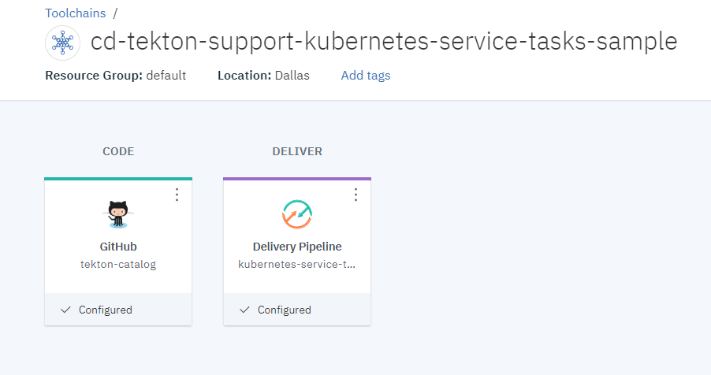
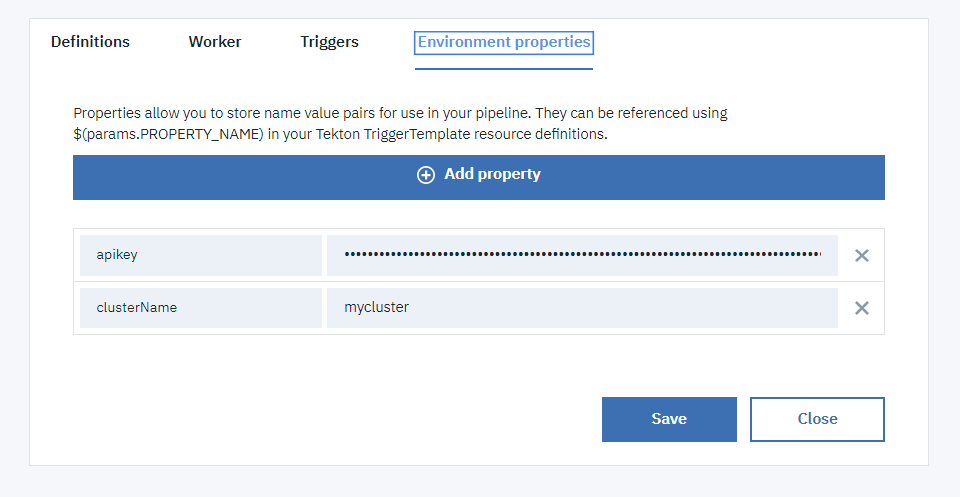
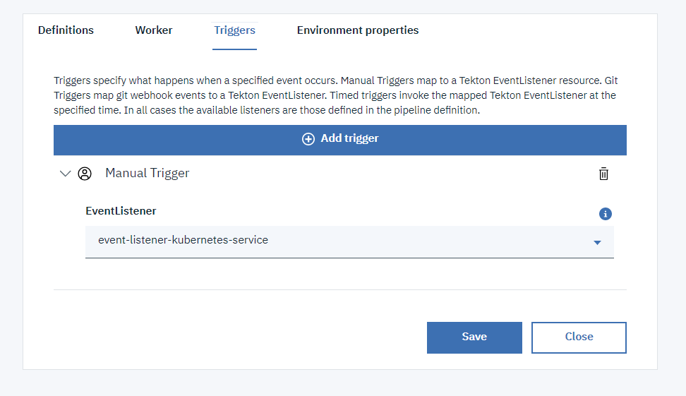

# Kubernetes-Service related tasks

- **[iks-fetch-config](#iks-fetch-config)**: This task is fetching the configuration of a [IBM Cloud Kubernetes Service cluster](https://cloud.ibm.com/docs/containers?topic=containers-getting-started) that is required to perform `kubectl` commands.
- **[iks-contextual-execution](#iks-contextual-execution)**: This task is executing bash snippet/script in the context of a Kubernetes cluster configuration.
- **[iks-deploy-to-kubernetes](#iks-deploy-to-kubernetes)**: This task allows to perform scripts typically doing deployment of a Kubernetes application with `ibmcloud ks` cli and `kubectl` cli configured for a given cluster.

**WARNING: These tasks needs to run on Kubernetes cluster with minimal version 1.16. If you are using your own Delivery Pipeline Private Worker to run your tekton pipeline(s), ensure your cluster is updated to this version at least.**

## Install the Tasks
- Add a github integration in your toolchain to the repository containing the task (https://github.com/open-toolchain/tekton-catalog)
- Add that github integration to the Definitions tab of your Continuous Delivery tekton pipeline, with the Path set to `kubernetes-service`

## Usage
The `sample` sub-directory contains an EventListener definition `kubernetes-service` that you can include in your tekton pipeline configuration to run an example usage of the `iks-fetch-config` and `iks-contextual-execution` tasks.

It also contains a `kubernetes-service-no-resources` EventListener definition which is the providing the same example but without the needs to define PipelineResources for cluster as it uses the task's parameter `cluster-name` to provide the information

1) Create a toolchain (or update a toolchain) to include:

   - the git repository that you want to clone, which can be private
   - the repository containing this tekton task
   - a tekton pipeline definition

   

2) Add the definitions:

   - for the tasks and the sample (`kubernetes-service` and `kubernetes-service/sample` paths)

   

3) Add the environment properties:

   - `apikey` to provide an API key used for the ibmcloud login/access
   - `cluster-name` to indicate the name of the IKS cluster that you want to target

   

4) Create a manual trigger to start the sample listener

   

5) Run the pipeline

## iks-fetch-config

Fetch IKS Cluster Configuration helper task

### Context - ConfigMap/Secret

  The task may rely on the following kubernetes resources to be defined:

* **Secret secure-properties**

  Secret containing:
  * **apikey**: An [IBM Cloud Api Key](https://cloud.ibm.com/iam/apikeys) used to access IBM Cloud Kubernetes Service. Note: secret name and secret key can be configured using Task's params.

  If this secret is provided, it will be used to obtain the the git token for the git integration in the toolchain

  Note: the `secure-properties` secret is injected in the Tekton Pipeline environment by Continuous Delivery Tekton Pipeline support. See [Tekton Pipelines environment and resources](https://cloud.ibm.com/docs/ContinuousDelivery?topic=ContinuousDelivery-tekton_environment#tekton_envprop)

### Parameters

* **resource-group**: (optional) target resource group (name or id) for the ibmcloud login operation.
* **cluster-region**: (optional) the ibmcloud region hosting the target cluster. If not specified, it will use the toolchain region as a default.
* **cluster-name**: (optional) the name of the cluster - required if no cluster pipeline resource provided to this task
* **cluster-pipeline-resources-directory-fallback**: (optional) that will be used as a fallback mechanism to store the kubeconfig file for the target cluster (expressed by the inputs)
* **pipeline-debug**: (optional) turn on task script context debugging
* **continuous-delivery-context-secret**: (optional) name of the secret containing the continuous delivery pipeline context secret (default to `secure-properties`)
* **kubernetes-service-apikey-secret-key**: (optional) field in the secret that contains the api key used to login to ibmcloud (default to `apikey`)
* **setup-step-image**: (optional) image to use for the setup step (default to `icr.io/continuous-delivery/pipeline/pipeline-base-image:2.6`)

### Workspaces

* **cluster-configuration**: A workspace where the kubernetes cluster config is exported

### Resources

#### Inputs

* **cluster**: (optional) the Cluster PipelineResource that will be updated as output of this task. Only the name property is used to identify the cluster name.

#### Outputs

* **cluster**: (optional) The Cluster PipelineResource that will be updated as output of this task.

## iks-contextual-execution

Kubernetes Contextual Execution helper task

### Parameters

* **cluster-name**: (optional) the name of the cluster - required if no cluster pipeline resource provided to this task
* **cluster-pipeline-resources-directory**: directory in which the kubeconfig file(s) for clusterPipelineResources are available (default to `/workspace` but this may need to be value of `iks-fetch-config#cluster-pipeline-resources-directory-fallback` if cluster pipeline resource update is not made by the `iks-fetch-config` task - ie using the fallback mechanism of kubeconfig copy to the pipelinerun pvc)
* **script**: the bash snippet to execute within the context of the kubernetes configuration (default to `kubectl version`)
* **execute-step-image**: (optional) image to use for the setup step (default to `icr.io/continuous-delivery/pipeline/pipeline-base-image:2.6`)
* **pipeline-debug**: (optional) turn on task script context debugging

### Workspaces

* **cluster-configuration**: A workspace that contain the kubectl cluster config to be used

### Resources

#### Inputs

* **cluster**: (optional) The Cluster PipelineResource that corresponds to the kubernetes cluster target for the kubectl command execution.

## iks-deploy-to-kubernetes

This task allows to perform scripts typically doing deployment of a Kubernetes application with `ibmcloud ks` cli and `kubectl` cli configured for a given cluster.

### Context - ConfigMap/Secret

  The task may rely on the following kubernetes resources to be defined:

* **Secret secure-properties**

  Secret containing:
  * **apikey**: An [IBM Cloud Api Key](https://cloud.ibm.com/iam/apikeys) used to access IBM Cloud Kubernetes Service. Note: secret name and secret key can be configured using Task's params.

  If this secret is provided, it will be used to obtain the the git token for the git integration in the toolchain

  Note: the `secure-properties` secret is injected in the Tekton Pipeline environment by Continuous Delivery Tekton Pipeline support. See [Tekton Pipelines environment and resources](https://cloud.ibm.com/docs/ContinuousDelivery?topic=ContinuousDelivery-tekton_environment#tekton_envprop)

### Parameters

* **resource-group**: (optional) target resource group (name or id) for the ibmcloud login operation.
* **cluster-region**: (optional) the ibmcloud region hosting the target cluster. If not specified, it will use the toolchain region as a default.
* **cluster-name**: (optional) the name of the cluster - required if no cluster pipeline resource provided to this task
* **continuous-delivery-context-secret**: (optional) name of the secret containing the continuous delivery pipeline context secret (default to `secure-properties`)
* **kubernetes-service-apikey-secret-key**: (optional) field in the secret that contains the api key used to login to ibmcloud (default to `apikey`)
* **image-url**: (optional) URL of an image that is relevant to the deployment action
* **shuttle-properties-file**: (optional) name of the properties file that contain properties to include in the environment for the `script` execution.
* **setup-script**: (optional) script that typically set up environment before the _deployment_ script execution.
* **script**: (optional) _deployment_ script to be executed
* **post-execution-script**: (optional) script that get executed after the _deployment_ script has been executed.
* **execute-step-image**: (optional) image to use for the execute step (default to `icr.io/continuous-delivery/pipeline/pipeline-base-image:2.17`)
* **pipeline-debug**: (optional) turn on task script context debugging

### Workspaces

* **artifacts**: A workspace containing artifacts/elements

### Results

* **cluster-name**: The cluster name
* **cluster-id**: The cluster identifier
* **resource-group-name**: The resource-group name that this cluster is part of
* **resource-group-id**: The resource-group identifier that this cluster is part of
* **region**: The region (ie us-south) where the cluster is located
* **app-url**: The running application's URL (obtained from APP_URL variable set by the executed script)
